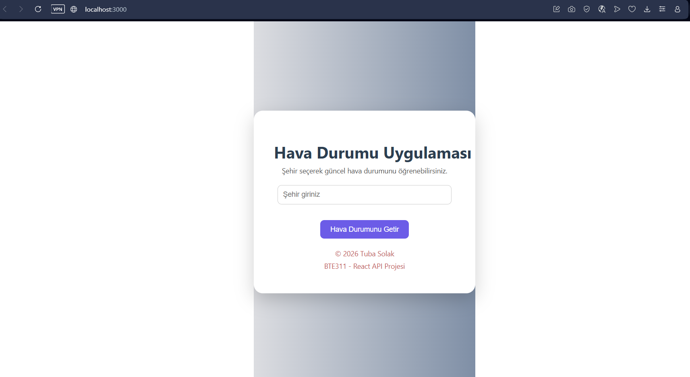
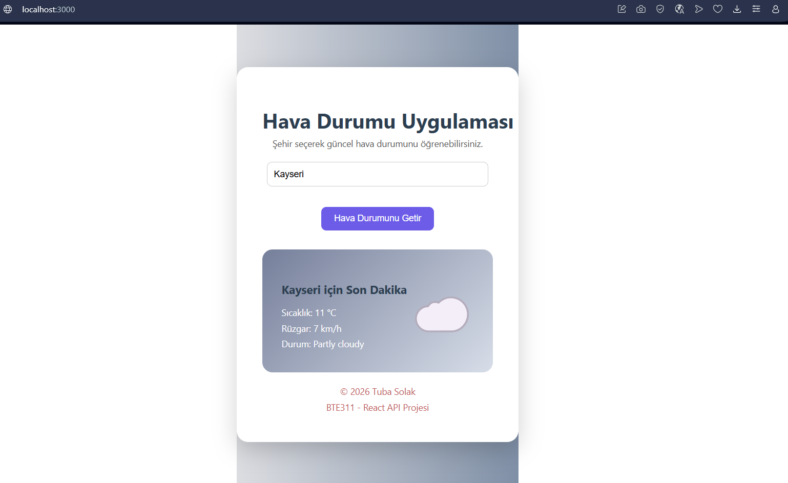
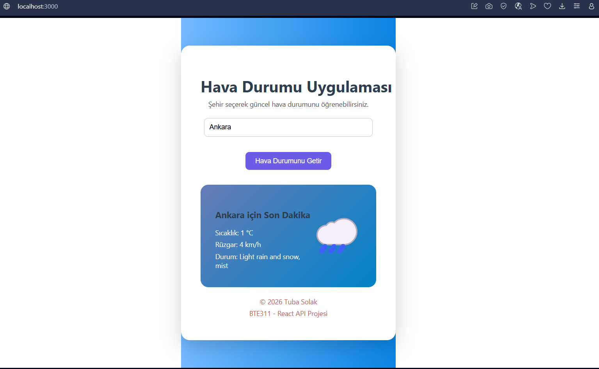
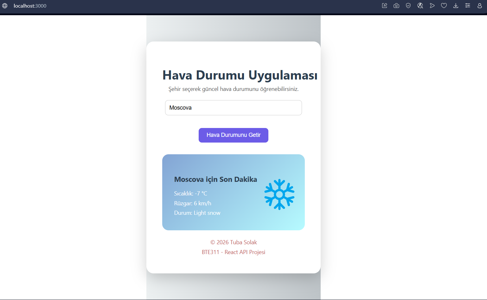
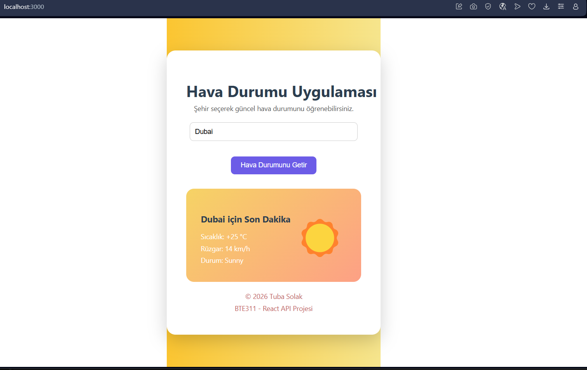
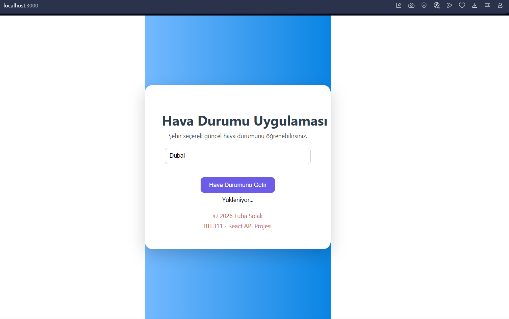
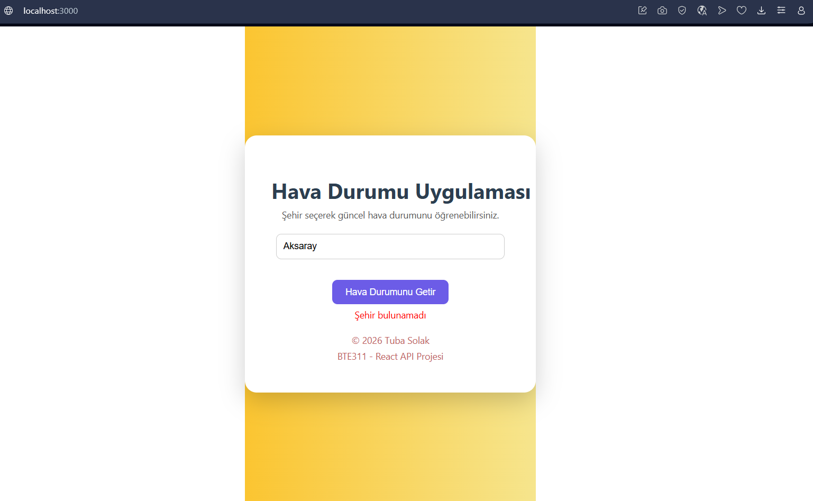

🌦️ React Hava Durumu Uygulaması
Bu proje, React kullanılarak açık bir API’den veri çekip kullanıcıya dinamik olarak sunan bir web uygulamasıdır.
Kullanıcıdan alınan şehir bilgisine göre hava durumu verileri görüntülenmektedir.

🔗 Kullanılan API
GoWeather API
  API Linki:
  https://goweather.herokuapp.com/weather/{city}

API anahtar gerektirmeyen, açık ve ücretsiz bir hava durumu API’sidir.

🧩 Proje Yapısı
  Header
  Sayfa başlığı ve kısa açıklama

  Content
  Kullanıcıdan şehir bilgisi alınan ve API’den gelen hava durumu verilerinin gösterildiği ana bölüm

  Footer
  Basit telif bilgisi

⚙️ Kullanılan Teknolojiler
  React
  JavaScript
  Fetch API
  React Hooks (useState, useEffect)
  CSS

## 📸 Uygulama Ekran Görüntüleri

### Ana Sayfa

### Bulutlu Hava Durumu

### Yağmurlu Hava Durumu

### Karlı Hava Durumu

### Güneşli Hava Durumu

### Yükleniyor Durumu

### Hata Durumu

## ▶️ Projenin Çalıştırılması
1. Bu projeyi bilgisayarınıza klonlayın:
git clone https://github.com/kullaniciadi/final-odevi.git
2. Proje klasörüne girin:
cd final-odevi
3. Gerekli paketleri yükleyin:
npm install
5. Tarayıcıda aşağıdaki adresten uygulamayı görüntüleyin:
http://localhost:3000
